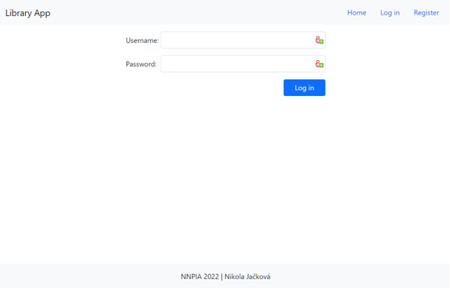
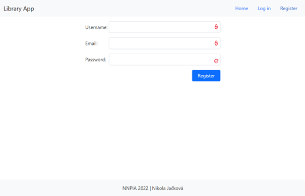
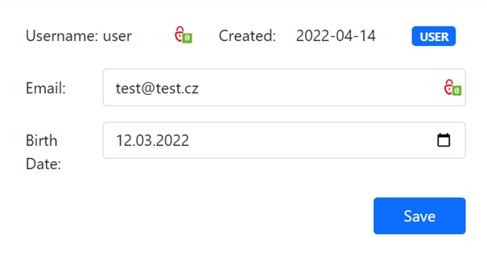
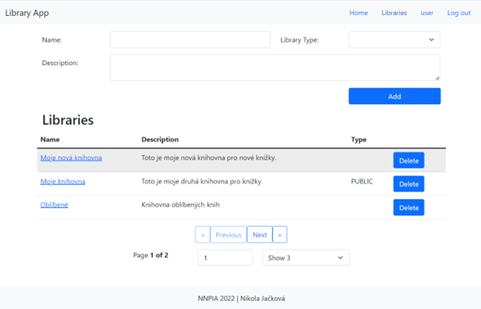
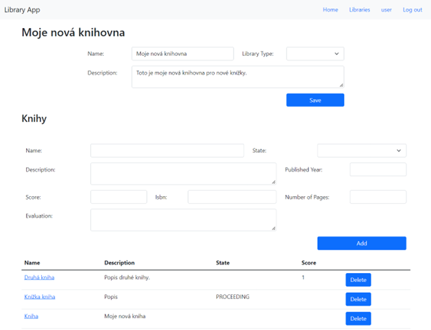
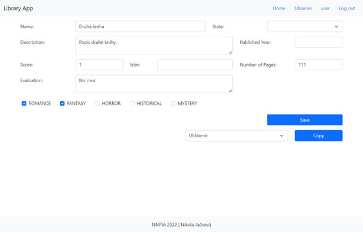
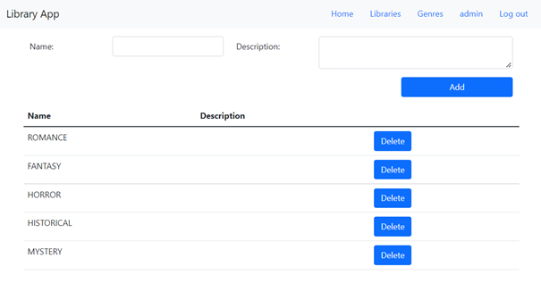

# Library React Application

This project is part of the semester work from the subject NNPIA.

## GUI

### USERS

Login page - user can log in with his username and password.

Register page - user can register with unique username and email and password.

User page

### LIBRARIES

Page with users libraries - user can add new library with upper form and can delete a library showed in table. 
The name of the library is link to detail page of library.

Detail page of library – user can edit attributes of library and add new book into library, he can also delete a book from this library. 
The name of the name is link to detail page of book.

### BOOKS

Detail page of book – user can edit attributes of a book and can also set genres for this book; he can also copy this book to another library with button Copy.

### GENRES

Genres page - admin can add and delete genres.

